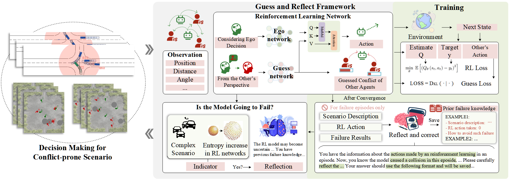
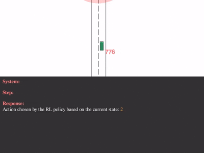
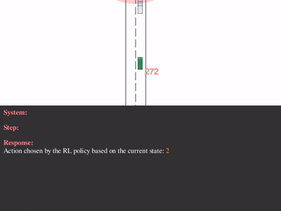
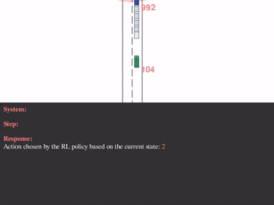
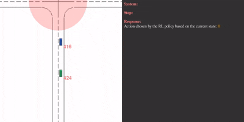
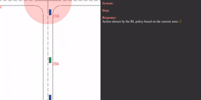
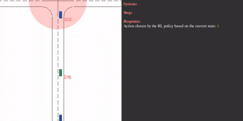
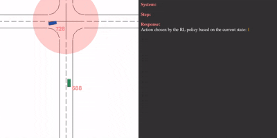
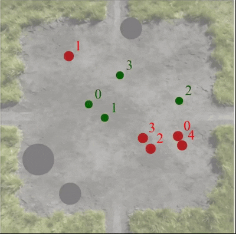
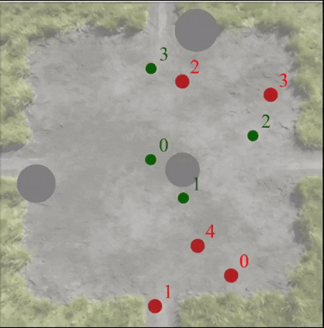

# Guess and Reflect: Learning-Based Decision Making for Autonomous Systems under Uncertain Conflict Environments
[arXiv]() | [paper]() | [website]()\
This repository is the official implementation of GaR.
This work proposes a guess-and-reflect decision-making framework, where the ego agents first generate actions through conflict-aware interactions, and then evaluate and correct potential failures.

<div style="text-align:center;">

</div>

Furthermore, GaR can be applied to a variety of conflict-prone decision-making tasks, demonstrating good performance and generalizability.


### Intersection Demos

(i) Scenario a
<div style="display:flex; justify-content:center; gap:5px;">
  
  
  
</div>

(ii) Scenario b
<div style="display:flex; justify-content:center; gap:5px;">
  
  
</div>

(iii) Scenario c
<div style="display:flex; justify-content:center; gap:5px;">
  
  
</div>

### Evasion Demos
<div style="display:flex; justify-content:center; gap:5px;">
  
  
  
</div>


## Table of Contents
+ [Setup](#setup)
+ [Training](#training)
+ [Validation](#validation)
+ [Acknowledgements](#acknowledgements)

## Setup

### Basic
Clone the repository and set up the environment:
```
git clone https://github.com/salt0107fish/GaR.git
cd GaR
conda create -n gar python=3.11
conda activate gar
pip install torch==2.5.1 torchvision==0.20.1 torchaudio==2.5.1 --index-url https://download.pytorch.org/whl/cu124
pip install -r requirement.txt
```

*Note:* For compatibility, you may experiment with different python / pytorch / vllm / ... versions. We use PyTorch 2.5.1 with cu124.

### For large language model deployment

If you need to deploy the LLM locally, please follow these steps:

(i) Install vllm

```
pip install vllm==0.7.3
```
(ii) Go to [Hugging Face](https://huggingface.co/) and choose a model.

(iii) Replace /PATH/TO/YOUR/MODEL/ with the path to your downloaded model, and start your server:

```
CUDA_VISIBLE_DEVICES=1 python -m vllm.entrypoints.openai.api_server --model /PATH/TO/YOUR/MODEL/ --port 8000 --tensor-parallel-size 1 --seed 1234
```

*Note:* For this project, we use the open-source LLaMA 8B model.


## Training


## Validation


## TODO LIST

- [x] Introduction & DEMO
- [x] Setup
- [ ] Validation scripts
- [ ] Training scripts


## Acknowledgements

## Citation
